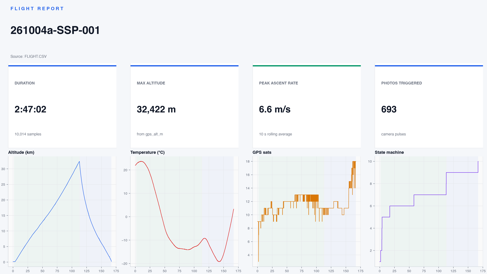

# HABFlight-SSP-001

**Stratospheric Sunday Project #1** — first successful high-altitude balloon
flight.  Launched from a field in **Bonnebosq (14)**, Normandy on
**2026-10-04 at 08:12 UTC**, drifted ~45 km south-east under a 2.6 m³ helium
balloon, apex at **32,422 m** (verified GPS), landed near **Livarot
Pays d'Auge (14)** 2 h 47 min later.  693 photos captured, 10 014 rows of
1 Hz telemetry logged, zero dropped samples.



## 👉 [Open the full flight report](https://nelsonsteinmetz.github.io/HABFlight-SSP-001/)

The report is a single self-contained page: KPIs, launch weather, 12
curated camera highlights, every sensor plot with phase shading and 10 km
altitude cross-references, an animated 3D trajectory, and the full detail
table. It is also what you get by opening `index.html` locally.

---

## Headline numbers

| | |
|---|---|
| **Duration** | 2 h 47 min 02 s (10 014 samples at 1 Hz) |
| **Max altitude** | **32 422 m** (GPS, QNH-independent) |
| **Peak ascent rate** | 6.6 m/s (2 min window) |
| **Max GPS satellites locked** | 18 |
| **Photos triggered** | 693 |
| **Launch** | 49.2326 °N, 0.0935 °E — Bonnebosq (14), 2026-10-04 08:12 UTC |
| **Landing** | Livarot Pays d'Auge (14) |
| **Launch weather** | clear sky, 12.5 °C, RH 86 %, 1011 hPa, NE 3.6 km/h |

## Hardware

| Role | Part |
|---|---|
| Flight controller | Arduino Pro Mini 3.3 V / 8 MHz (ATmega328P) |
| GPS | ATGM336H-5N (COCOM-free, verified above 18 km) |
| Pressure + temperature | BMP180 (I²C, accurate to ~9 km) |
| Camera | ESP32-CAM (OV2640, UXGA JPEG, 120° / 75 mm lens) |
| Storage | 2 × SanDisk Extreme Pro 128 GB (one per MCU) |
| Recovery | StratoFinder GSM tracker |
| Power | 4 × Energizer Ultimate Lithium AA |
| Balloon / parachute | Stratoflights 1000 g kit, 2.6 m³ helium |

Everything is wired on a single hand-soldered proto board. Full build notes
and the Arduino sketches that produced this flight live upstream in the
author's hardware project — this repo captures only what the flight itself
produced.

## Repository contents

```
.
├── index.html          ← full self-contained flight report (GitHub Pages entrypoint)
├── summary.png         ← one-glance dashboard (KPIs + 4 micro-plots)
├── FLIGHT.CSV          ← raw 1 Hz telemetry, 10 014 rows × 15 columns
├── highlights.txt      ← curated list of 12 photos shown in the report gallery
├── plot/               ← every chart referenced by the report
│   ├── plot_altitude_dual.png   (BMP180 vs GPS end-to-end)
│   ├── plot_ascent_rate.png     (vertical rate, 2 min window)
│   ├── plot_temperature.png     (ambient profile including tropopause minimum)
│   ├── plot_pressure.png
│   ├── plot_track_satellite.png (altitude-coloured path over ESRI imagery)
│   ├── plot_track_3d.png        (static 3D view)
│   ├── plot_track_3d.gif        (4 s ping-pong rotation)
│   ├── plot_track_3d.mp4        (10 s 60 fps smooth rotation)
│   ├── plot_gps_health.png
│   ├── plot_sample_rate.png
│   └── plot_state.png           (12-state flight-state progression)
├── camera/             ← the 12 highlighted photos from the 693-image set
└── README.md
```

## CSV schema

| Column | Unit | Notes |
|---|---|---|
| `sample_id` | — | Monotonic, written by the sketch. 1 → 10 014. |
| `utc_date`, `utc_time` | — | From the GPS NMEA stream. Populated once the module has a time fix. |
| `millis` | ms | MCU uptime at log-write time. Use for Δt analysis; `t_s` is derived from it. |
| `temp_c` | °C | BMP180 inside the payload. |
| `pressure_pa` | Pa | BMP180 raw. |
| `bmp_alt_m` | m | BMP180-derived altitude; **unreliable above ~9 km**. |
| `gps_alt_m` | m | GPS altitude, authoritative end-to-end. |
| `lat`, `lon` | ° | WGS84. |
| `sats` | — | Satellites used in the current position solution. |
| `gps_age_ms` | ms | TinyGPS staleness of the current `lat/lon`. |
| `state` | 0–12 | Flight-state machine: 0 WAITING → 12 LANDED (full table in the report). |
| `alt_source` | B / G | Which sensor drove the state transition on this row. |
| `photo_id` | — | Set only on rows where the sketch pulsed the camera trigger. |

## Flight data quality

- **No dropped samples** — `sample_id` is contiguous, Δt median = 1001 ms.
- **Strong GPS lock throughout** — the `sats` column climbed to 18 across
  the stratosphere.
- **CSV has one spurious header row from boot test** — handled by the
  analyzer's session detector; raw file is untouched.
- **BMP180 vs GPS altitude** diverges above ~9 km, as expected. The report
  uses GPS altitude for all KPIs; the BMP curve is kept for comparison.

## Methodology

The flight-report page is rendered by `analyze.py` (upstream) from the raw
CSV plus `highlights.txt`. All curves live in the `plot/` folder as PNG;
the 3D trajectory also exists as a 4 s GIF loop and a 10 s H.264 clip.
Launch weather is fetched from Open-Meteo at render time; cached HTML is
captured in this repo.

Click any plot in the report to open a full-screen lightbox. Diagnostic
sections (State machine, Sample interval) start collapsed so the headline
story stays uncluttered. Abbreviations (UTC, QNH, EMI, ESRI, …) carry
hover-tooltip definitions.

## License

Code and documentation are licensed under the terms of the `LICENSE` file
in this repo. The ESRI World Imagery tiles embedded in the ground-track
plots are © Esri and partners; redistribution follows the ESRI terms of
use (private, non-commercial research is allowed).
